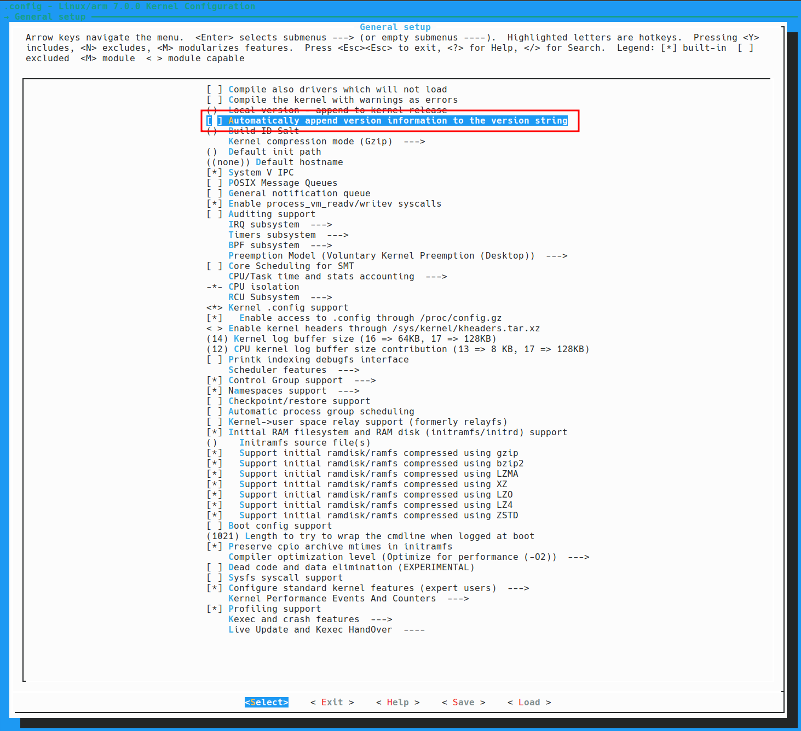
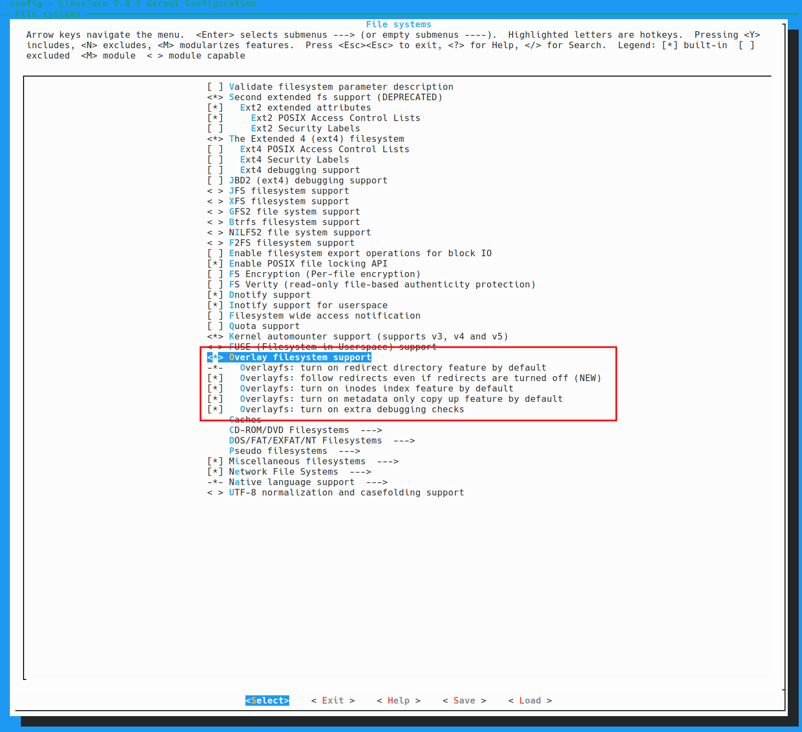
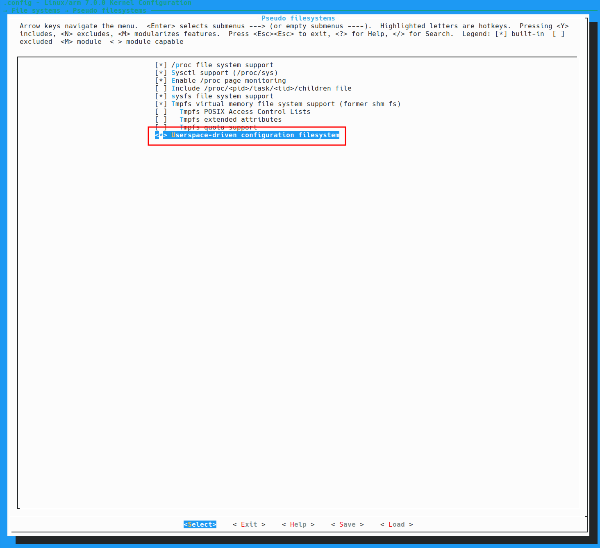

# TP1 : Mise en place du système

Dans ce TP vous allez construire un système Linux _from scratch_. 
Il est construit comme un tutoriel. Il n'y aura pas beaucoup d'explications, mais des questions pour vous aider à comprendre ce que vous faites. Répondez-y.

Certaines étapes peuvent être assez longues (téléchargement du noyau, compilation du noyau...). Utilisez ces temps-morts pour répondre aux questions et rédiger votre rapport.

En toute transparence, ce TP est très fortement inspiré du tutoriel présent à cette adresse :

https://github.com/zangman/de10-nano/blob/master/README.md#getting-started

N'hésitez pas à vous servir de ce tuto pour répondre aux questions.

## Outils à installer et configuration du système

Toutes les étapes présentées ici ont déjà été effectuées sur les PC de l'école. Vous pouvez passer à l'étape suivante.

```bash
yay -S ncurses flex bison openssl dkms libelf systemd-libs pciutils libmpc autoconf bc
```

```bash
yay -S extra/debootstrap extra/qemu-user-static extra/qemu-user-static-binfmt
```

```bash
sudo usermod -a -G uucp $USER
```

## Récupérer le bon compilateur

1. Créez un dossier de travail :

```bash
mkdir emb
cd emb
```

> **Important** : Certains téléchargements sont très longs (gcc, u-boot, linux). Ils sont disponibles sur le compte ese, dans `~/Documents/assets_tp_linux`. Vous pouvez copier le contenu de ce dossier vers votre dossier `emb/`. Les lignes correspondant aux téléchargements sont indiqués en commentaires.

2. Si vous travaillez avec git (et c'est recommandé) il faudra que l'outil ignore ce dossier, car il sera particulièrement volumineux.

Créez un fichier ```.gitignore``` (au même niveau que emb) et ajoutez-y la ligne suivante :

```bash
emb/
```

3. Téléchargez le compilateur gcc pour ARM.

```bash
#wget https://developer.arm.com/-/media/Files/downloads/gnu/15.2.rel1/binrel/arm-gnu-toolchain-15.2.rel1-x86_64-arm-none-linux-gnueabihf.tar.xz

tar -xvf arm-gnu-toolchain-15.2.rel1-x86_64-arm-none-linux-gnueabihf.tar.xz

rm arm-gnu-toolchain-15.2.rel1-x86_64-arm-none-linux-gnueabihf.tar.xz

export CROSS_COMPILE=$PWD/arm-gnu-toolchain-15.2.rel1-x86_64-arm-none-linux-gnueabihf/bin/arm-none-linux-gnueabihf-
```

4. Que fait ```wget``` ?

5. Que signifient les paramètres ```-xvf``` passés à la commande ```tar```

6. Quel type d'objet est ```CROSS_COMPILE``` ? Pourquoi est-ce que la ligne finit par un tiret ```-``` ?


## Construire le bootloader (U-Boot)

### Récupérer les sources

1. Dans le dossier ```emb/```, télécharger ```u-boot``` :

```bash
#git clone https://github.com/u-boot/u-boot.git
```

2. Récupérez une version compatible avec notre carte :

```bash
cd u-boot
#git tag
git checkout v2021.07
```

### Configuration

#### Configurez U-Boot pour configurer automatiquement le FPGA au démarrage

1. Éditez le fichier ```u-boot/include/config_distro_bootcmd.h```, cherchez les lignes suivantes:

```C
  BOOT_TARGET_DEVICES(BOOTENV_DEV)                                  \
  \
  "distro_bootcmd=" BOOTENV_SET_SCSI_NEED_INIT                      \
    BOOTENV_SET_NVME_NEED_INIT                                \
    BOOTENV_SET_IDE_NEED_INIT                                 \
    BOOTENV_SET_VIRTIO_NEED_INIT                              \
    "for target in ${boot_targets}; do "                      \
      "run bootcmd_${target}; "                         \
    "done\0"

#ifndef CONFIG_BOOTCOMMAND
#define CONFIG_BOOTCOMMAND "run distro_bootcmd"
#endif
```

2. Et modifiez ```distro_bootcmd``` de la manière suivante:

```C
  BOOT_TARGET_DEVICES(BOOTENV_DEV)                                  \
  \
  "distro_bootcmd= " \
    "if test -e mmc 0:1 u-boot.scr; then " \
      "echo --- Found u-boot.scr ---; " \
      "fatload mmc 0:1 0x2000000 u-boot.scr; " \
      "source 0x2000000; " \
    "elif test -e mmc 0:1 soc_system.rbf; then " \
      "echo --- Programming FPGA ---; " \
      "fatload mmc 0:1 0x2000000 soc_system.rbf; " \
      "fpga load 0 0x2000000 0x700000; " \
    "else " \
      "echo u-boot.scr and soc_system.rbf not found in fat.; " \
    "fi; " \
    BOOTENV_SET_SCSI_NEED_INIT                      \
    BOOTENV_SET_NVME_NEED_INIT                                \
    BOOTENV_SET_IDE_NEED_INIT                                 \
    BOOTENV_SET_VIRTIO_NEED_INIT                              \
    "for target in ${boot_targets}; do "                      \
      "run bootcmd_${target}; "                         \
    "done\0"

#ifndef CONFIG_BOOTCOMMAND
#define CONFIG_BOOTCOMMAND "run distro_bootcmd"
#endif
```

#### Définir une adresse MAC

Cette section sert à fixer une adresse MAC. Sans ça, on aurait une adresse MAC aléatoire à chaque démarrage. 

1. Quels seraient les risques ?

2. Dans le dossier u-boot, compilez et exécuter l'outil de génération d'adresse MAC :

```bash
make -C tools gen_eth_addr
tools/gen_eth_addr
```

Vous obtiendrez une adresse MAC selon le format suivant :

```bash
22:d6:5c:3d:93:4b
```

3. Copiez-là et sauvegardez-la quelque part.

4. Ouvrez le fichier suivant ```u-boot/include/configs/socfpga_common.h``` et cherchez les lignes suivantes :

```C
#define CFG_EXTRA_ENV_SETTINGS \
	"fdtfile=" CONFIG_DEFAULT_FDT_FILE "\0" \
	"bootm_size=0xa000000\0" \
	"kernel_addr_r="__stringify(CONFIG_SYS_LOAD_ADDR)"\0" \
	"fdt_addr_r=0x02000000\0" \
	"scriptaddr=0x02100000\0" \
	"pxefile_addr_r=0x02200000\0" \
	"ramdisk_addr_r=0x02300000\0" \
	"socfpga_legacy_reset_compat=1\0" \
	BOOTENV
```

5. Et ajoutez la ligne ```ethaddr```. Remplacez l'adresse MAC par celle que vous avez sauvegardé précédemment.
N'oubliez pas le ```\0``` et le ```\```.

```C
#define CFG_EXTRA_ENV_SETTINGS \
	"fdtfile=" CONFIG_DEFAULT_FDT_FILE "\0" \
	"bootm_size=0xa000000\0" \
	"kernel_addr_r="__stringify(CONFIG_SYS_LOAD_ADDR)"\0" \
	"fdt_addr_r=0x02000000\0" \
	"scriptaddr=0x02100000\0" \
	"pxefile_addr_r=0x02200000\0" \
	"ramdisk_addr_r=0x02300000\0" \
	"socfpga_legacy_reset_compat=1\0" \
	"ethaddr=22:d6:5c:3d:93:4b\0" \
	BOOTENV
```

#### Finir la configuration

1. Préparer la configuration par défaut :

```bash
make ARCH=arm socfpga_de10_nano_defconfig
```

2. La configuration par défaut devrait suffire. Vous pouvez aller voir la configuration manuelle avec la commande suivante :

```bash
make ARCH=arm menuconfig
```

### Compilation

1. Compiles u-boot :

```bash
make ARCH=arm -j 8
```

2. Que signifie ```-j 8``` ?

Si la compilation s'est bien déroulée, vous devriez avoir un fichier ```u-boot-with-spl.sfp```.
Il contient le bootloader combiné au secondary program loader (spl).

## Compiler le Kernel

### Télécharger le Kernel

1. Dans le dossier ```emb/```, téléchargez le noyau linux :

```bash
#git clone https://github.com/altera-opensource/linux-socfpga.git
cd linux-socfpga
#git branch -a
git checkout socfpga-7.0
```

### Configurer le kernel

1. Construisez la configuration par défaut pour un socfpga altera :

```bash
make ARCH=arm socfpga_defconfig
```

2. Lancez la configuration manuelle :

```bash
make ARCH=arm menuconfig
```

3. Dans ```General setup```, décochez ```Automatically append version information to the version string```



4. Dans ```File systems```, activez ```Overlay filesystem support``` avec toutes les options :



5. Dans ```File systems/Pseudo filesystems```, activez ```Userspace-driven configuration filesystems``` :



https://github.com/zangman/de10-nano/blob/master/docs/Building-the-Kernel.md#kernel-options

6. Compilez le noyau (pendant ce temps expliquez le rôle des 3 options que vous avez modifiés ci-dessus) :

```bash
make ARCH=arm LOCALVERSION=zImage -j 8
```

## Constuire le Root File System Debian

### Debootstrap First stage

1. Dans le dossier ```emb/```:

```bash
sudo mkdir rootfs

sudo debootstrap --arch=armhf --foreign trixie rootfs
```

2. Qu'est-ce que ```Debian``` ? Qu'est-ce que ```trixie``` ?

### Second stage

1. Lancez les commande suivantes :

```bash
sudo cp /usr/bin/qemu-arm-static rootfs/usr/bin/

sudo chroot rootfs /usr/bin/qemu-arm-static /bin/bash -i

/debootstrap/debootstrap --second-stage
```

2. Quel est le rôle de la commande ```chroot``` ?

3. Que fait la commande ```deboostrap``` ?

### Configuration

1. Toujours dans le terminal _chrooté_ :

```bash
apt install vim -y
```

2. Editez le fichier ```/etc/hostname``` et changez le nom en ```de10-<vos initiales>```.

3. Mettez un mot de passe (suffisamment simple pour vous en rappeler, suffisamment complexe pour qu'on ne vous fasse pas de mauvaises blagues) :

```bash
passwd
```

Rien n'apparaît quand vous tapez votre mot de passe, c'est normal.

4. Copiez les lignes suivantes dans le fichier ```/etc/fstab``` :

```bash
none		    /tmp	tmpfs	defaults,noatime,mode=1777	0	0
/dev/mmcblk0p2	/	    ext4	defaults	                0	1
```

Quel est le rôle du fichier ```fstab``` ?

5. Activez la liaison série en tapant la commande suivante :

```bash
systemctl enable serial-getty@ttyS0.service
```

6. Configurez et installez les locales :

```bash
apt install locales -y
export PATH=$PATH:/usr/sbin
dpkg-reconfigure locales
```

Ajoutez la locale en_US.UTF-8. Qu'est-ce qu'une locale ?

7. Dans le fichier ```/etc/network/interfaces```, sous la ligne ```source-directory /etc/network/interfaces.d```, ajoutez : 


```bash
auto lo end0
iface lo inet loopback

allow-hotplug end0
iface end0 inet dhcp
```

8. Installez un serveur ssh :

```bash
apt install openssh-server -y
```

Ajoutez (ou décommentez) la ligne ```PermitRootLogin yes``` dans le fichier ```/etc/ssh/sshd_config```.

9. Le reste :

```
apt install haveged -y
apt install net-tools build-essential device-tree-compiler -y
```


### Nettoyage

1. Toujours dans le terminal _chrooté_ :

```bash
apt clean
rm /usr/bin/qemu-arm-static
exit
```

```exit``` vous fait sortir de l'environnement ```chroot```.

### Création d'un tarbal

Dans le dossier ```emb```:

```bash
cd rootfs
sudo tar -cjpf ../rootfs.tar.bz2 .
cd ..
```

## Création de la carte SD

1. Dans le dossier ```emb```:

```bash
mkdir sdcard
cd sdcard
```

2. Créez une image vide de 2GB :

```bash
sudo dd if=/dev/zero of=sdcard.img bs=2G count=1
```

3. Rendre l'image visible comme un device.

```bash
sudo losetup --show -f sdcard.img
```

### Partitionner l'image

Pour que Linux puisse démarrer, il faut 3 partitions comme dans le tableau ci-dessous.

| Order | Partition              | Partition Type | Partition Number | Last Sector | FS Type       | FS Hex Code |
| ----- | ---------------------- | -------------- | ---------------- | ----------- | ------------- | ----------- |
| 1     | U-Boot and SPL         | primary        | 3                | +1M         | Altera Custom | a2          |
| 2     | Kernel and Device Tree | primary        | 1                | +254M       | fat32         | b           |
| 3     | Root Filesystem        | primary        | 2                | _default_   | ext4          | 83          |

1. Qu'est-ce qu'une partition ?

2. Utilisez l'outil ```fdisk``` pour partitionner le fichier.

```bash
sudo fdisk /dev/loop0
```

3. Appuyez sur `p` puis `Entrée` pour voir la liste des partitions:

```bash
Welcome to fdisk (util-linux 2.42.1).
Changes will remain in memory only, until you decide to write them.
Be careful before using the write command.

Device does not contain a recognized partition table.
Created a new DOS (MBR) disklabel with disk identifier 0x4a4d3a1e.

Command (m for help): p
Disk /dev/loop0: 2 GiB, 2147479552 bytes, 4194296 sectors
Units: sectors of 1 * 512 = 512 bytes
Sector size (logical/physical): 512 bytes / 512 bytes
I/O size (minimum/optimal): 512 bytes / 512 bytes
Disklabel type: dos
Disk identifier: 0x4a4d3a1e

Command (m for help): 
```

#### Partition du bootloader

Il n'y a pas de partitions pour le moment. Vous allez les créer une par une :

1. `n`, `Entrée`
2. `p`, `Entrée`
3. `3`, `Entrée`
4. `Entrée`
5. `+1M`, `Entrée`

Vous devriez voir les lignes suivantes :

```bash
Command (m for help): n
Partition type
   p   primary (0 primary, 0 extended, 4 free)
   e   extended (container for logical partitions)
Select (default p): p
Partition number (1-4, default 1): 3
First sector (2048-4194295, default 2048): 
Last sector, +/-sectors or +/-size{K,M,G,T,P} (2048-4194295, default 4194295): +1M

Created a new partition 3 of type 'Linux' and of size 1 MiB.

Command (m for help): 
```

La partition est de type `Linux` par défaut. Il faut la changer en `Altera Custom`. Ce n'est pas un standard, donc il faut la configure en m^de `a2` :

1. `t`, `Entrée`
2. `a2`, `Entrée`

```bash
Command (m for help): t
Selected partition 3
Hex code (type L to list all codes): a2
Changed type of partition 'Linux' to 'unknown'.
```

#### Kernel and Device Tree partition

Pour créer la prochaine partition :

1. `n`, `Entrée`
2. `p`, `Entrée`
3. `1`, `Entrée`
4. `Entrée`
5. `+254M`, `Entrée`

La sortie devrait ressembler à ça :

```bash
Command (m for help): n
Partition type
   p   primary (1 primary, 0 extended, 3 free)
   e   extended (container for logical partitions)
Select (default p): p
Partition number (1,2,4, default 1): 1
First sector (4096-4194295, default 4096): 
Last sector, +/-sectors or +/-size{K,M,G,T,P} (4096-4194295, default 4194295): +254M

Created a new partition 1 of type 'Linux' and of size 254 MiB.
```

Changez le type de partition :

1. `t`, `Entrée`
2. `1`,`Entrée`
3. `b`, `Entrée`

```bash
Command (m for help): t
Partition number (1,3, default 3): 1
Hex code (type L to list all codes): b

Changed type of partition 'Linux' to 'W95 FAT32'.

Command (m for help):
```

#### Partition du rootfs

Pour la dernière partition, vous allez utiliser le reste de l'espace disponible :

1. `n`, `Entrée`
2. `p`, `Entrée`
3. `2`, `Entrée`
4. `Entrée`
5. `Entrée`

```bash
Command (m for help): n
Partition type
   p   primary (2 primary, 0 extended, 2 free)
   e   extended (container for logical partitions)
Select (default p): p
Partition number (2,4, default 2): 2
First sector (524288-4194295, default 524288): 
Last sector, +/-sectors or +/-size{K,M,G,T,P} (524288-4194295, default 4194295): 

Created a new partition 2 of type 'Linux' and of size 1,7 GiB.
```

Vous allez garder le type `Linux` pour cette partition.

#### Writing the partition table

1. Vérifiez que les partitions ont été correctement créées: 
`p`, `Entrée`


```bash
Command (m for help): p
Disk /dev/loop0: 2 GiB, 2147479552 bytes, 4194296 sectors
Units: sectors of 1 * 512 = 512 bytes
Sector size (logical/physical): 512 bytes / 512 bytes
I/O size (minimum/optimal): 512 bytes / 512 bytes
Disklabel type: dos
Disk identifier: 0x4a4d3a1e

Device       Boot  Start     End Sectors  Size Id Type
/dev/loop0p1        4096  524287  520192  254M  b W95 FAT32
/dev/loop0p2      524288 4194295 3670008  1,7G 83 Linux
/dev/loop0p3        2048    4095    2048    1M a2 unknown
```

2. Les partitions créées ne sont pas encore écrites sur le fichier image. Faites le :
`w`, `Entrée`:

```bash
Command (m for help): w
The partition table has been altered.
Calling ioctl() to re-read partition table.
Re-reading the partition table failed.: Invalid argument

The kernel still uses the old table. The new table will be used at the next reboot or after you run partprobe(8) or kpartx(8).
```

Une erreur indique que les partitions ne sont pas chargées par le noyau.

3. Si vous tapez :

```bash
ls /dev/loop0*
```

Vous verrez qu'il n'y a qu'un fichier `/dev/loop0` et que les partitions ne sont pas visibles.

4. Pour y accéder, vous devez taper la commande suivante :

```bash
sudo partprobe /dev/loop0
```

5. Elles sont maintenant visibles :

```bash
ls /dev/loop0*
```

Devrait vous donenr le résultat suivant :

```bash
/dev/loop0  /dev/loop0p1  /dev/loop0p2  /dev/loop0p3
```

### Créer les systèmes de fichiers

1. Créez deux systèmes de fichiers :

```bash
# Partition 1 is FAT
sudo mkfs -t vfat /dev/loop0p1

# Partition 2 is Linux
sudo mkfs.ext4 /dev/loop0p2
```

### Writing to the partitions

Dans cette partie, vous allez remplir ces nouvelles partitions.

#### Bootloader partition

La partition bootloader est une partition binaire. Il ne faudra pas la _monter_, mais copier le bootloader compilé bit à bit à l'aide de la commande `dd` :

1. Dans le dossier ```emb/``` :
```bash
cd sdcard
sudo dd if=../u-boot/u-boot-with-spl.sfp of=/dev/loop0p3 bs=64k seek=0 oflag=sync
```

#### Partition Kernel et Device Tree

This is a fat partition, so we'll need to mount it first and copy the files:

1. Dans le dossier ```emb/``` :

```bash
cd sdcard
mkdir -p fat

# Mount the fat partition.
sudo mount /dev/loop0p1 fat

# Copy the kernel image.
sudo cp ../linux-socfpga/arch/arm/boot/zImage fat

# Copy the de0 device tree.
sudo cp ../linux-socfpga/arch/arm/boot/dts/intel/socfpga/socfpga_cyclone5_de0_nano_soc.dtb fat

# Create the extlinux config file for the bootloader.
echo "LABEL Linux Default" > extlinux.conf
echo "    KERNEL ../zImage" >> extlinux.conf
echo "    FDT ../socfpga_cyclone5_de0_nano_soc.dtb" >> extlinux.conf
echo "    APPEND root=/dev/mmcblk0p2 rw rootwait earlyprintk console=ttyS0,115200n8" >> extlinux.conf

# Copy it into the extlinux folder.
sudo mkdir -p fat/extlinux
sudo cp extlinux.conf fat/extlinux

# Unmount the partition.
sudo umount fat
```

#### Partition Root Filesystem

1. Dans le dossier ```emb/``` :

```bash
cd sdcard
mkdir -p ext4

# Mount the ext4 partition.
sudo mount /dev/loop0p2 ext4

# Extract the rootfs archive.
cd ext4
sudo tar -xvf ../../rootfs.tar.bz2

# Unmount the partition.
cd ..
sudo umount ext4
```

### Writing to SD Card

The hard work is done. Now all that's left is to write the `sdcard.img` file to an actual SD Card and we're ready to boot.

Vous allez maintenant écrire l'_image_ `sdcard.img` sur une carte SD.

1. Qu'est-ce qu'une _image_ ?

> **Attention** - Si vous vous trompez de _device_, il n'y aura pas de _warnings_, vous risquez d'écraser le disque dur du PC. Faites vérifier par votre enseignant !

2. Dans le dossier ```emb/```

```bash
cd sdcard

# Identify your SD Card device.
lsblk

# Write to the correct device (Ex: /dev/sdb).
sudo dd if=sdcard.img of=/dev/sdb bs=64K status=progress oflag=sync
```

## Tester sur la carte

1. Branchez la carte SD sur la de10-nano.

2. Connectez le port USB sur UART (c'est le connecteur mini-usb proche du connecteur ethernet).

3. Branchez le cable ethernet au routeur.

4. Lancez minicom pour récupérer la sortie UART de la carte.

```bash
minicom -D /dev/ttyUSB0
```

5. Alimentez la carte.

6. Le seul compte existant est ```root```. Connectez vous avec le mot de passe défini plus haut.

7. Testez la connection internet.

8. Écrivez un programme simple de type ```hello, world```, juste pour tester.
