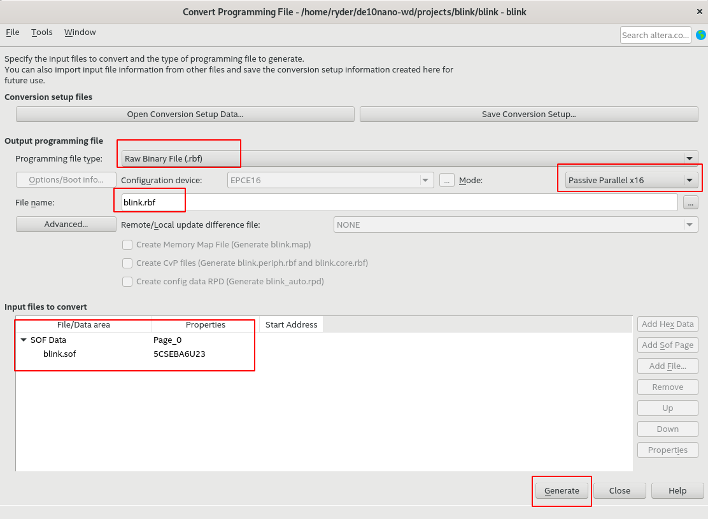

# TP4 : Flasher le FPGA

## Flasher le FPGA

[https://github.com/zangman/de10-nano/blob/master/docs/Flash-FPGA-from-HPS-running-Linux.md](https://github.com/zangman/de10-nano/blob/master/docs/Flash-FPGA-from-HPS-running-Linux.md)

1. Créez un projet avec le FPGA `5CSEBA6U23I7`
2. Exemple code vhdl :

```vhdl
library ieee;
use ieee.std_logic_1164.all;

entity blink is
	port (
		i_clk : in std_logic;
		i_sw : in std_logic_vector(1 downto 0);
		o_leds : out std_logic_vector(7 downto 0)
	);
end entity blink;

architecture rtl of blink is
	constant counter_max : integer := 10000000;
	signal rst_n : std_logic;
	signal leds : std_logic_vector(7 downto 0) := x"01";
begin
	rst_n <= i_sw(0);
	o_leds <= leds;

	process(i_clk, rst_n)
		variable counter : integer range 0 to counter_max := 0;
	begin
		if rst_n = '0' then
			counter := 0;
			leds <= x"01";
		elsif rising_edge(i_clk) then
			if counter = counter_max then
				leds(7 downto 1) <= leds(6 downto 0);
				leds(0) <= leds(7);
				counter := 0;
			else
				counter := counter + 1;
			end if;
		end if;
	end process;

end architecture rtl;
```

3. Fichier de contraintes `.qsf`

```tcl
set_location_assignment PIN_V11 -to i_clk
set_location_assignment PIN_AH16 -to i_sw[1]
set_location_assignment PIN_AH17 -to i_sw[0]
set_location_assignment PIN_AA23 -to o_leds[7]
set_location_assignment PIN_Y16 -to o_leds[6]
set_location_assignment PIN_AE26 -to o_leds[5]
set_location_assignment PIN_AF26 -to o_leds[4]
set_location_assignment PIN_V15 -to o_leds[3]
set_location_assignment PIN_V16 -to o_leds[2]
set_location_assignment PIN_AA24 -to o_leds[1]
set_location_assignment PIN_W15 -to o_leds[0]
```

4. Compilez le projet comme d'habitude

5. `File` > `Convert Programming Files`



6. Copiez le fichier rbf sur la de10-nano

```bash
scp blink.rbf root@<ipaddress>:~
```

[https://github.com/zangman/de10-nano/blob/master/docs/Flash-FPGA-On-Boot-Up.md](https://github.com/zangman/de10-nano/blob/master/docs/Flash-FPGA-On-Boot-Up.md)

7. Sur la de10-nano :

```bash
mount /dev/mmcblk0p1 /mnt
cp blink.rbf /mnt/soc_system.rbf
umount /mnt
reboot
```

8. TADA!

## Communication HPS/FPGA

### Activer le bridge

[https://github.com/zangman/de10-nano/blob/master/docs/Configuring-the-Device-Tree.md](https://github.com/zangman/de10-nano/blob/master/docs/Configuring-the-Device-Tree.md)

Les device-tree ont bougés : `vim arch/arm/boot/dts/intel/socfpga/socfpga.dtsi`

`make ARCH=arm my_custom.dtb` ne fonctionne pas. Il faut modifier `arch/arm/boot/dts/intel/socfpga/Makefile`.

Puis `make ARCH=arm dtbs`

Une LED blink dans le verilog, on pourra l'enlever

### Écrire un driver

[https://github.com/zangman/de10-nano/blob/master/docs/Write-Linux-Driver.md](https://github.com/zangman/de10-nano/blob/master/docs/Write-Linux-Driver.md)

```make LOCALVERSION=zImage prepare``` dans `linux-socfpga`

> TODO Tester sans LOCALVERSION=zImage (à enlever aussi dans la compilation du noyau)

change prototype de `leds_remove` return void au lieu de int

```echo -n -e '\xAA' > /dev/custom_leds```


### Interruptions

Objectif : Un compteur d'interruption simple en module noyau

> **TODO** actuellement, `soc_system.dts` est généré par platform designer, et on intègre ce qui est généré dans les dts du noyau. C'est pas hyper satisfaisant.

Ça marche. Qu'est-ce qu'un platform device ?

Comment fonctionne probe ? 

Comment rendre read/write blocant ? -> easy