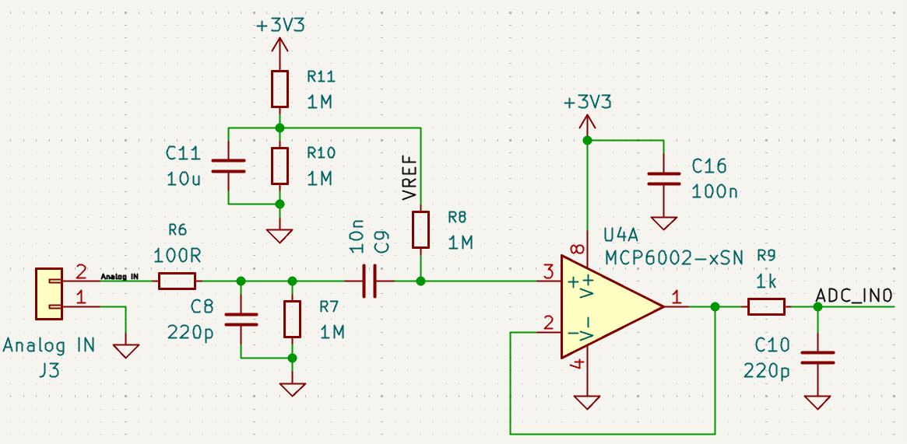
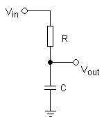

# 3DN TD KiCAD
## Objectifs

Concevoir un PCB disposant d'une entrée et d'une sortie analogique pour réaliser un algorithme de filtrage numérique.

### Liste des AAV
1. Lister les composants nécessaires au STM32 pour fonctionner,
2. Concevoir un schéma propre, sans erreurs, lisible et maintenable,
3. Décrire les règles de placement des composants : Connecteurs, HMI, faciliter le routage,
4. Configurer les contraintes du logiciel en fonction des règles du fabricant (DFM pour Design for Manufacturability), 
5. Router un circuit en appliquant un ensemble de règles pour éviter les problèmes de CEM (Compatibilité Électro-Magnétique),
6. Générer les fichiers de fabrication.

### Composants à utiliser

* **MCU:** STM32G031K8T6
* **LDO:** MIC5504-3.3YM5
* **DAC:** MCP4801
* **AOP:** MCP6002-I/SN (Boitier ```SOIC-8_3.9x4.9mm_P1.27mm```)
* **Composants passifs et LED :** boîtier 0603
* **Connecteurs (alim et entrée/sorties analogiques) :** JST-XH

## Conception de PCB

### Schématique

Durant toute cette partie, aidez-vous du logiciel **STM32CubeMX**.

1. Câblez le STM32. Pensez au connecteur de programmation.
2. Câblez le DAC au STM32.
3. Câblez l'alimentation. La carte sera alimentée en 5V, le circuit fonctionne en 3.3V.
4. Câblez au minimum : 1 LED de power et 2 LED de status.
5. Pensez à ajouter tous les composants passifs (capas découplage, résistances)

#### Front-end analogique

L'entrée analogique doit être traitée avant d'entrer dans l'ADC. Il en va de même pour la sortie. On parle respectivement de front-end et de back-end analogique.



1. Détaillez le rôle des différents composants dans la figure ci-dessus.
2. Câblez ce circuit dans votre projet.


3. Détaillez le rôle des différents composants dans la figure ci-dessus.
4. Câblez ce circuit dans votre projet.

### Routage

1. Configurez votre PCB en 4 couches
2. Configurez les contraintes suivantes :
    * ```Track width``` en 0.1mm
    * ```Clearance``` en 0.1mm
    * ```Vias``` ```Diameter``` : **0.5mm** ; ```Hole``` : **0.3mm**
3. Configurez le cartouche
4. Importez les composants
5. Placez les trous selon un carré de **40mm** de côté
6. Tracez les ```Edge.Cuts```. Le PCB devra être aux dimensions de **48mm * 48mm**.
7. Placez les composants. Les connecteurs doivent être en bordure.
8. Créez les ```Filled Zones``` de masse et d'alimentation sur les couches ```In1.Cu``` et ```In2.Cu``` respsectivement.
8. Connectez les alimentations et les masses à l'aide de vias.
9. Terminez le routage.
10. Ajouter un plan de masse sur les couches **Top** et **Bottom**.
11. Retirez les antennes parasites. Ajoutez des _stitching vias_.
12. Vérifiez qu'il n'y ait pas d'erreurs dans _Design Rule Checker_.

#### Finitions

1. Organisez proprement la sérigraphie.
2. Ajoutez toutes les informations qui vous semble nécessaire sur la sérigraphie.
3. Ajoutez un logo.
4. Vérifiez dans la vue 3D.
5. Revérifiez les DRC. On sait jamais.

#### Fichiers de fabrication

1. Générez les fichers de fabrication GERBER ainsi que les fichiers de perçage.
2. Faites une simulation de commande sur le site [JLCPCB](https://jlcpcb.com/).

## Fabrication

Les PCB seront fabriqués par la société [JLCPCB](https://jlcpcb.com/).

1. Soudez les composants.

### Tests

1. Démarrez une alimentation de laboratoire. Configurez une tension de **5V** et une limite de courant de **0.1A**. Branchez votre carte à l'alimentation. La LED POWER doit s'allumer. Mesurez la tension en sortie du régulateur
2. Créez un projet et importez-le dans ```STM32CubeIDE```. Compilez.
3. Branchez la sonde de programmation STLink à votre carte et à l'ordinateur.
4. Programmez.
5. Testez un programme simple, par exemple en faisant clignoter une LED.

## Programmation

1. Configurez un timer pour déclencher une interruption à une fréquence de **32 kHz**. Testez à l'oscilloscope.
2. Programmez le DAC pour sortir un signal _sawtooth_ d'une fréquence de **1kHz**. Observez à l'oscilloscope.
3. Configurez l'ADC pour prendre des mesures. Vous pourrez tester en renvoyant les échantillons mesurés directement sur le DAC.

### Filtrage



1. Écrivez l'équation différentielle régissant le filtre RC ci-contre. Mettre l'équation sous la forme suivante:
    $$V_{in} = X \cdot \frac{dV_{out}(t)}{dt} + Y \cdot V_{out}$$
2. Écrivez l'équation de récurrence correspondante. On peut remplacer $\frac{dV(t)}{dt}$ par $\frac{V[n] - V[n-1]}{T}$.
    Pour faciliter le codage, on utilisera plutôt l'expression suivante:
        $$f_s \cdot \left(V[n] - V[n-1]\right)$$
    Avec $f_s$ la fréquence d'échantillonnage.
3. Mettre sous la forme suivante:
    $$V_{out}[n] = \frac{A \cdot V_{in}[n] + B \cdot V_{out}[n-1]}{D}$$
4. Donnez les expressions de $A$, $B$ et $D$.
                Remplacez $RC$ par $\frac{1}{2 \cdot \pi \cdot f_c}$.
5. Pour une fréquence d'échantillonnage de **32kHz**, combien de cycles processeurs disposons-nous pour traiter chaque échantillon?
6. Écrivez le code permettant d'appliquer le filtre aux échantillons.
Vous choisirez une fréquence de coupure assez faible (eg. 320Hz) et mesurerez le diagramme de Bode à l'oscilloscope.
